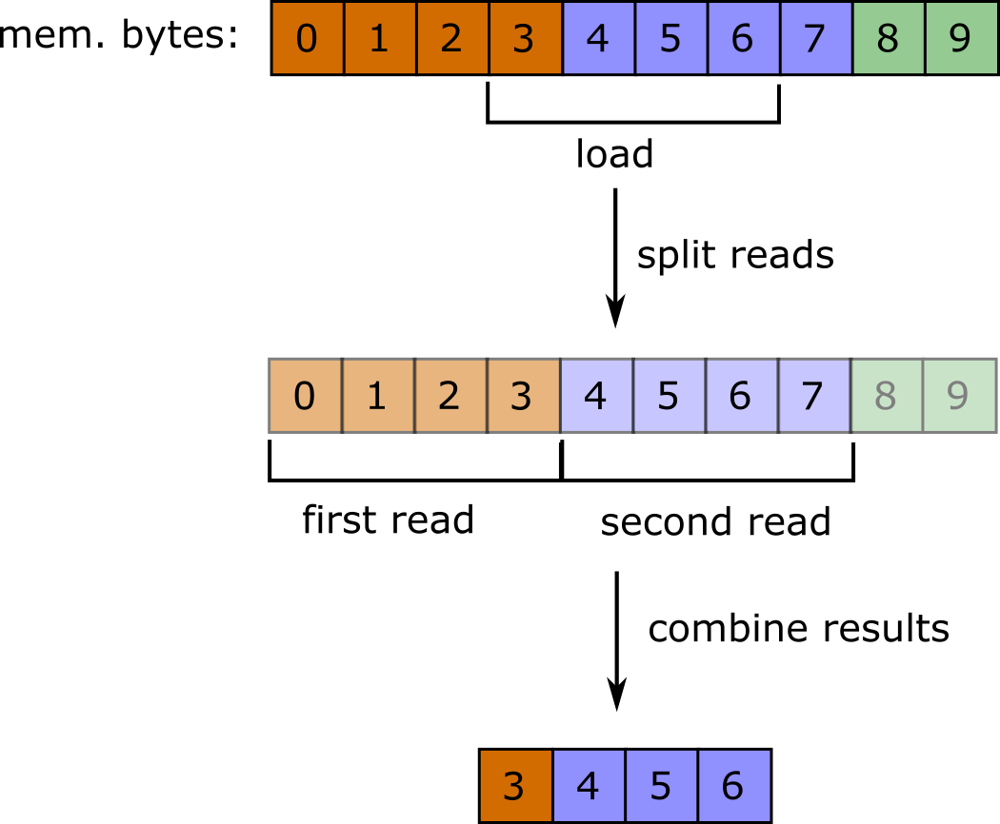
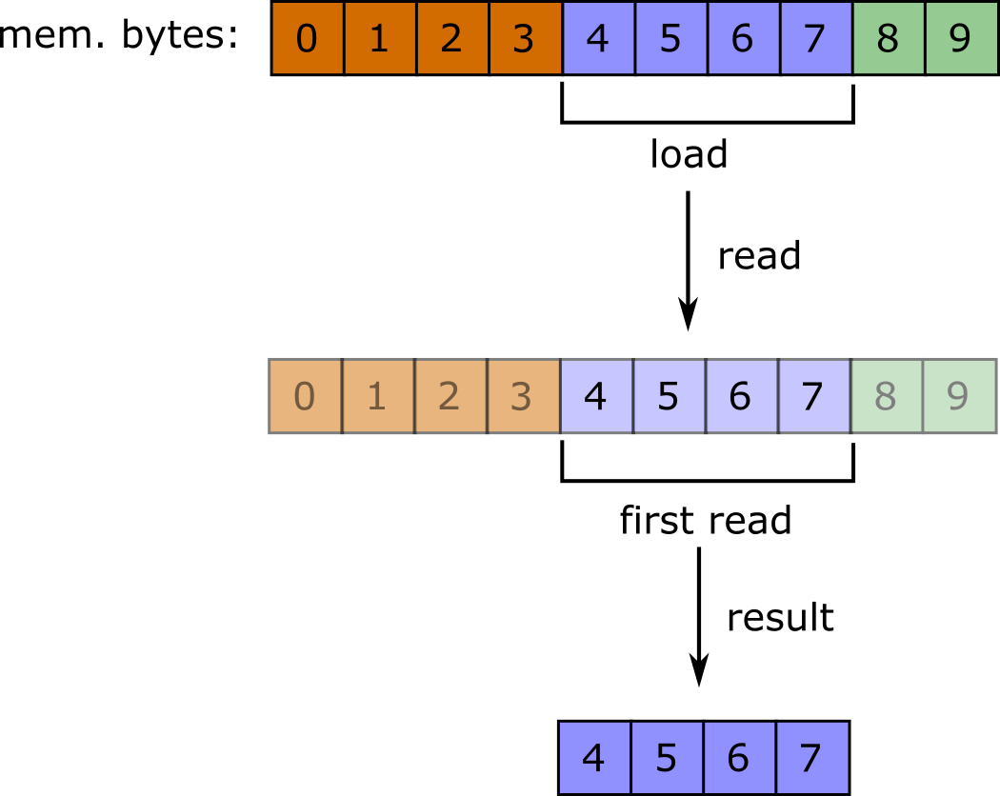

# План лекции "SIMD - что это такое и зачем это может пригодиться?"

1. SIMD - что это такое: концепт параллелизма данных на одном процессоре
2. SIMD - полезные знания из курса архитектуры ЭВМ, которые помогут быть полезны при внедрении векторизации в код.
	1. SIMD регистры 
	2. Выравнивание памяти
3. Как обстоят дела с SIMD в C#?
	1. Небольшая справка про то, почему SIMD долго не появлялся в C#, а появился в не до конца оптимальном варианте
	2. // Возможные варианты внедрения SIMD расширений в свой код
	3. Как начать работать с SIMD в C#
4. Пример оптимизации которая ускоряет. 
5. Пример оптимизации задачи - сумма элементов массива с помощью SIMD
6. Пример оптимизации которая полезна.
7. Может ли компилятор векторизовать код за нас?
	1. C#
	2. C++ для примера
8. Когда стоит векторизовать код самостоятельно?
	1. Советы и мнения
	2. Примеры проектов, которые использую векторизацию. Успешны ли они?

## SIMD - что это такое?
**SIMD** - Single Instruction Multiple Data. Расшифровывается дословно как "одна инструкция, много данных".

- SIMD это расширение процессора. Если на вашем компьютере нет поддержки каких-то SIMD операций, то их никак не установить.
- SIMD позволяет выполнить одну операцию над набором данных одновременно. Т.е. SIMD обеспечивает параллелизм данных в рамках одного процессора.

Как SIMD обеспечивает параллелизм?

  
Можно считать, что обычное ALU может обрабатывать одну порцию данных за раз.

В то же время, SIMD ALU может обработать сразу несколько порций данных за то же время, за которое обычное ALU обрабатывает одну.

В чем же секрет?

Таким образом, в SIMD ALU просто находится несколько арифметико-логических устройств, которые обрабатывают разные куски данных полученных на вход одновременно.

### SIMD в процессорах
SIMD это всего лишь концепт. Существует множество его реализаций в разных процессорах. Мы будем рассматривать только SIMD расширения процессоров Intel.

- Современные процессоры Intel обычно поддерживают такие SIMD расширения как SSE4.1/SSE4.2, AVX
- SSE4.x позволяет выполнять различные операции над 128-битными векторами (операции могут проводиться как с 4 значениями типа `int`, 2 значениями типа `float` и т.п.)
- Отличие SSE4.1/4.2 между собой в наборе поддерживаемых инструкций
- AVX позволяет выполнять операции над 256-битными векторами
- Как узнать, какие расширения поддерживает процессор:
	- Windows: `wmic cpu get name`. Найти процессор на [сайте Intel](https://ark.intel.com/). Изучить поле *Расширения набора команд* (*Instruction set extensions*)
	- Linux: `cat /proc/cpuinfo`. Проверить наличие флагов `sse4.1`, `sse4.2`, `avx` в поле `flags`

# Немного вспомним архитектуру ЭВМ

Я расскажу про несколько моментов, которые могут быть полезны при написании несложного, но эффективного SIMD кода.

В примерах на `C#` мы не встретимся с такими проблемами, потому что
    
1. `C#` сам заботится о некоторых проблемах либо не позволяет их допускать
2. Наши примеры будут достаточно простые

## SIMD регистры

- Все SIMD операции производятся через специальные SIMD регистры
- `XMM0-XMM15` - 128-битные регистры
- `YMM0-YMM15` - 256-битные регистры. 
- Важно понимать, что их конечно число
	- Если у вас много временных переменных, которые должны быть SIMD векторами, будьте готовы к многочисленным копированием данных из памяти в XMM/YMM регистры и обратно. Это может быть причиной непредвиденных задержек.
- Конечно, один из операндом SIMD инструкции может быть непосредственно указатель на адрес в памяти: `pxor xmm1 [memory address]`. Но я точно не знаю, правда ли задержка такой операции такая же, как `pxor xmm1 xmm2`.
- В любом случае хотя бы один XMM/YMM регистр будет использован

## Выравнивание данных

Что такое выравнивание?

- Известно, что контроллер памяти за раз умеет оперировать данными фиксированного размера - машинными словами
- В дополнении к этому, контроллер памяти за раз может оперировать не со всеми данными в памяти. А именно, контроллер может прочитать данные по адресу, только если данный адрес кратен размеру машинного слова
- Такое свойство адреса называется выравненностью

Так можно представлять себе ячейки памяти:

Однако контроллер памяти видит их сложнее. Как минимум он видит их так:

Соответственно запрос чтения данных по невыравненному адресу для контроллера памяти выглядит гораздо сложнее, чем запрос чтения по выравненному адресу. Например, контроллер может прозрачно для нас произвести два чтения и скомбинировать этот результат, чтобы получить значения по запрошенному адресу:

В то время, как запрос чтения по выравненному адресу выполниться без дополнительных накладных расходов:

### Выравнивание и SIMD

- Старые SSE расширения часто требовали выравненности загружаемых указателей по границе в 128-бит. В случае нарушения этого правила, инструкция генерировала исключения и программа экстренно завершалась
- В AVX многие инструкции допускают работу с невыравненными данными. Однако это может повлечь за собой уменьшение производительности. Причиной могут являться специфика работы процессора, контроллера памяти и т.п.
- Поэтому если вы пишете SIMD код на языке, поддерживающем ручное выравнивание переменных/массивов - не забывайте про этот факт

# SIMD в C# 

- Поддержка SIMD появилась в C# относительно недавно - в 2014 году. Такая задержка связана с конкретной архитектурой CLR и текущая реализация SIMD в C# все еще не полностью поддерживает весь функционал доступных расширений
- Что нужно, чтобы работать с SIMD в C#?
	- RyuJIT Jitter. В C#, CIL нет никаких специальных векторных инструкций, поэтому они внедряются в код приложения на этапе JIT-компиляции. RyuJIT знает о классах пространства имен System.Numerics.Vectors и транслируют CIL, относящийся к ним, в специальные векторные ассемблерные инструкции
	- .NET версии >= 4.6
	- 64-битное приложение
- Все необходимые для работы с SIMD инструменты находятся в пространстве имен System.Numerics.Vectors  

Чтобы выполнить все эти условия, достаточно поменять настройки сборки вашего проекта:

- Отключить *Предпочитать 32-битную версия* (*Prefer 32-bit version*) 
- Включить *Оптимизировать код*
- Возможно, скачать `System.Numerics.Vectors`

# Перед тем как перейти к примерам

Очевидные и простые замечания, которые я все-таки хотел бы сделать:

Что нужно сделать перед тем, как векторизовать какой-либо кусок кода.

1. Хорошо покройте его тестами. Легко ускорить код с помощью SIMD, при этом сделав его неверным. Тесты должны включать в себя:
	* Тесты на небольшом объеме данных (массив длины 2, матрица 3x2)
	* Тесты на достаточно большом объеме данных (массив длины 100, матрица 10x10)
	* Тесты на достаточно большом объеме данных, размер которых не кратен степени двойки (массив длины 55, матрица 7x7)
2. Напишите нормальный benchmark - не нужно мерять время исполнения "на глаз" или "на stopwatch"
3. Добейтесь максимальной производительности (желательно не в ущерб читаемости) не векторизованного кода.

Как можно обработать массив данных с помощью SIMD?

#### Грубый и очень простой фреймворк векторизации кода:

1. Отбросить немного данных так, чтобы размер оставшихся был кратен максимальному размеру SIMD регистра
2. Обработать основной массив данных с помощью SIMD расширений
3. Наивным образом обработать откинутую часть данных
4. Скомбинировать результаты, если нужно

В дальнейших слайдах я буду считать, что размер данных всегда кратен размеру SIMD регистра, поэтому буду опускать шаги 1, 3 и шаг 4 будет упрощен.

